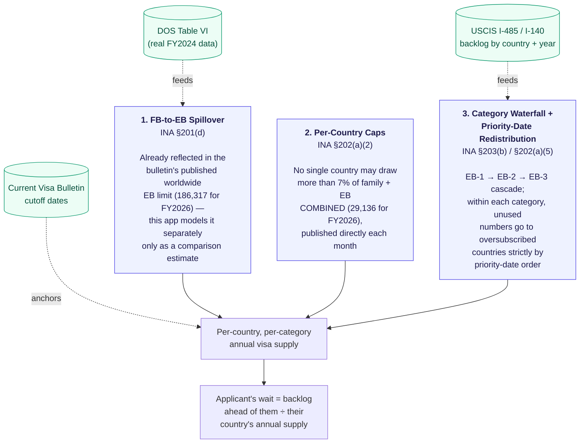
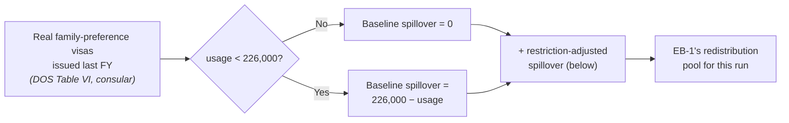
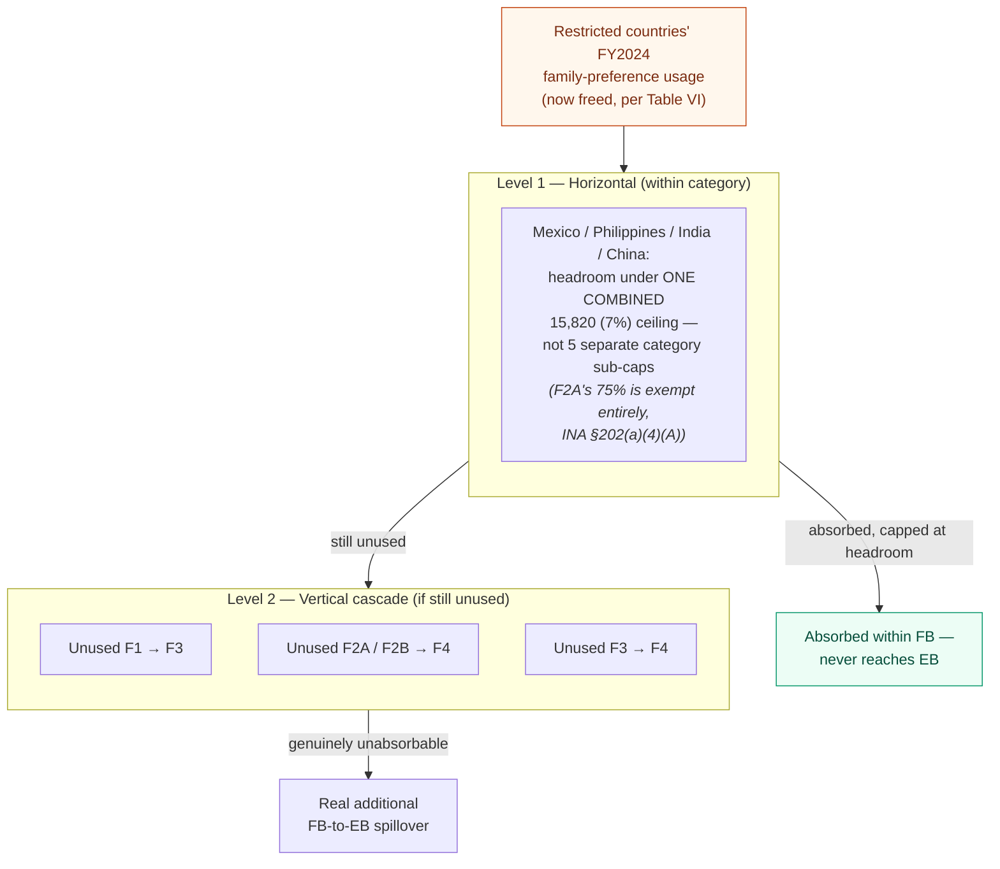
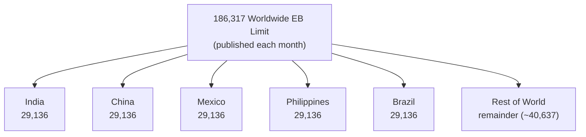
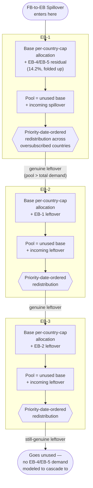
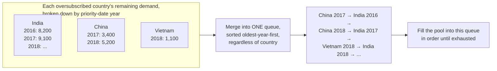

# GreenCardPredictor

A Spring Boot service that predicts U.S. employment-based (EB) green card **Filing** and **Final
Action** dates for a given country, EB category, and priority date — by actually simulating the
statutory visa-allocation mechanics (INA §201, §202, §203) against real USCIS/DOS data, rather than
guessing from historical trend lines.

> Built on real data where it's obtainable, honestly labeled placeholders where it isn't. See
> [`GAPS_AND_FIXES.md`](GAPS_AND_FIXES.md) for the full changelog and every known limitation, and
> [`DATA_SOURCES.md`](DATA_SOURCES.md) for exactly which government reports back which number.

## What it actually predicts

Given `{country, category, priorityDate}`, it returns:

- **Filing date** — when you can submit Form I-485 / DS-260 (Visa Bulletin Chart B)
- **Final Action date** — when your green card can actually be approved (Visa Bulletin Chart A)
- **A full `reasoningSteps` trace** — every intermediate number the calculation used, in order,
  so the result isn't a black box

It does **not** predict what a *future* Visa Bulletin will say. It takes one bulletin's real,
published cutoff dates as an input and computes how long an applicant's *own* wait is against that
bulletin — a materially different (and much more tractable) problem than forecasting DOS's monthly
cutoff-date decisions.

## Quick start

Requires JDK 17+ (the project's own `pom.xml` pins `java.version=21` for the compiler `--release`
flag).

```bash
./mvnw spring-boot:run
```

```bash
curl -u admin:admin123 -X POST http://localhost:8080/api/prediction/predict \
  -H "Content-Type: application/json" \
  -d '{"country":"INDIA","category":"EB3","priorityDate":"2019-12-16"}'
```

`admin`/`admin123` are the default dev credentials in `application.properties` — change them before
deploying this anywhere real.

## How it works

### The three statutory mechanisms

Everything the algorithm does traces back to three sections of the INA, applied in this order:



### Mechanism 1 — FB-to-EB Spillover (INA §201(d))

Congress sets a **226,000/year floor** for family-sponsored visas. Whatever of that floor goes
unused in a fiscal year rolls over to the employment-based pool the *next* year — entering
specifically at **EB-1**, not spread across all three categories.

**As of the fix documented in [`GAPS_AND_FIXES.md` #16](GAPS_AND_FIXES.md):** the current bulletin
publishes the worldwide EB annual limit directly (186,317 for FY2026), and that number already has
whatever spillover actually happened this fiscal year baked in — DOS computes it from real USCIS
data before the bulletin goes out. So the default prediction path uses that published total as-is
rather than re-deriving an estimate of it. The modeling below still runs on every request and is
shown in the API's `reasoningSteps`, but purely as a sanity-check comparison against the real
number — it no longer feeds the actual supply calculation.



**But that baseline number is FY2024** — a year before Presidential Proclamation 10998 (the
39-country travel ban) even existed. It can't reflect what happens to the family system *now* that
those countries get zero family visas. A tempting shortcut — just subtract what those countries used
to get, and hand the difference straight to EB — turns out to be wrong: family-preference visas have
their *own* per-country caps and internal redistribution, same as employment-based. Unused numbers
don't leave the family system until they've had nowhere else to go *within* it.

**So this app models that internal redistribution for real** (`FamilyPreferenceSpilloverService`),
using DOS Table VI's category-level breakdown (F1, F2A, F2B, F3, F4) per INA §202(a)(5)'s two-level
rule:



**The real, code-computed result:** the four named countries had **24,222** of combined headroom in
FY2024 — more than the **20,935** restricted countries would have used. Everything gets absorbed at
Level 1; nothing reaches Level 2 or EB. **Genuine additional spillover from the restriction = 0** —
this runs for real on every prediction (see the `[FB-SPILLOVER]` log line), not a one-off
calculation; it'll move automatically if the underlying data ever changes. Full methodology and every
documented simplification: [`GAPS_AND_FIXES.md` #15](GAPS_AND_FIXES.md).

### Mechanism 2 — Per-Country Caps (INA §202(a)(2))

Only five countries currently have their own named line on the Visa Bulletin's per-country chart —
**India, China, Mexico, Philippines, Brazil** — each capped at 7% of the family-sponsored *and*
employment-based limits **combined** (226,000 + 186,317 = 412,317 for FY2026 → **29,136**, including
the EB-5 carryover under INA §203(b)(5)(B); DOS also publishes 28,862 without it). This app reads
both the worldwide EB limit and this per-country cap straight from the current bulletin
(`visa-bulletin.yml`) rather than deriving either — see
[`GAPS_AND_FIXES.md` #16](GAPS_AND_FIXES.md) for why re-deriving them from a fixed 140,000 base was
off by roughly 26,000. Every other country falls under *"All Chargeability Areas Except Those
Listed"* (ROW), sharing whatever remains of the worldwide limit after the five named countries'
caps.



Every other country enum in the codebase (restricted or not) gets **zero** individual base
allocation — it can only receive supply through redistribution, exactly like the real bulletin's
"All Chargeability Areas" treatment. Giving every country its own 7% share was a real bug found and
fixed this year (see GAPS_AND_FIXES.md #9); a related bug in how ROW's residual was computed once
the per-country cap stopped being a flat 7% of the EB base was found and fixed in #16.

### Mechanism 3 — The Waterfall + Priority-Date Redistribution (INA §203(b) / §202(a)(5))

This is the core of the engine. For each category, in **EB-1 → EB-2 → EB-3** order:



**Why horizontal (cross-country) redistribution runs *before* the vertical cascade to the next
category** — this is the opposite of the codebase's original order, and matters a lot: if the
vertical cascade ran first (draining every country's surplus down the chain before any other
country got a look at it), EB-1 and EB-2 could *never* receive cross-country redistribution — 100%
of the world's unused capacity would always land in EB-3 by construction. Verified and fixed this
year; see GAPS_AND_FIXES.md #13.

**Priority-date-ordered redistribution**, in detail:



Every country's own yearly buckets sum to exactly its own remaining demand, so this construction
guarantees **no country can ever receive more redistributed visas than it actually needs** — a
correctness property that used to require an iterative "water-filling" algorithm to enforce and now
falls out for free. See GAPS_AND_FIXES.md #14.

### End-to-end request flow


**Filing and Final Action are independent charts.** DOS can mark Final Action "Unauthorized" (the
annual ceiling is hit) while still publishing a real Filing cutoff, specifically so people can keep
submitting paperwork and get interim benefits (EAD/AP) while waiting for new numbers. A past version
of this code collapsed both into "N/A" the moment Final Action hit its ceiling — fixed; see
GAPS_AND_FIXES.md #12.

## Reading a response

Every prediction includes a `reasoningSteps` array — the calculation's own trace, in order:

```json
{
  "formattedFilingWait": "August 2029",
  "formattedFinalActionWait": "October 2030",
  "reasoningSteps": [
    "1. Checked restriction status for INDIA: not restricted.",
    "2. Worldwide EB annual limit = 186317 and per-country cap = 29136 (published directly in the September 2026 bulletin -- INA 202(a)(2)'s 7% ceiling on family+EB combined, not derived from a fixed base).",
    "3. FB-to-EB spillover: not modeled separately in the default path, since the published worldwide EB limit above already reflects whatever spillover actually occurred this fiscal year (DOS computes it from real USCIS data before publishing the bulletin).",
    "4. (Informational only) this app's own modeled FB-to-EB spillover estimate, for comparison against the published total: family-preference usage 205762 vs. floor 226000 -> baseline 20238, plus restriction-adjusted 0 (INA 202(a)(5) redistribution) = 20238. Modeled EB base (140000 + 20238 = 160238) vs. published 186317.",
    "5. Ran the full supply model: base allocation (from the published worldwide limit and per-country cap above), FB spillover injected at EB-1, EB1->EB2->EB3 waterfall with horizontal (cross-country, priority-date-ordered) redistribution ...",
    "6. INDIA EB3 resulting annual supply (after redistribution): ~14605.",
    "7. September 2026 bulletin Filing Cut-off for INDIA EB3: 2015-01-15.",
    "8. Backlog (I-485 inventory + I-140 approvals) between the Filing Cut-off and priority date 2019-12-16: 43268 cases ahead of you.",
    "9. September 2026 bulletin Final Action Cut-off for INDIA EB3: 2014-01-01.",
    "10. Filing wait = 43268 / 14605 * 12 = 35 months; Final Action wait = ...",
    "Conclusion: Filing August 2029, Final Action October 2030."
  ]
}
```

(Real, code-computed output — this app's own estimate of what the published worldwide limit "should" be, 160,238, is now visibly ~26,000 short of the real 186,317, which is exactly the discrepancy [`GAPS_AND_FIXES.md` #16](GAPS_AND_FIXES.md) fixed: the *supply calculation* uses the real 186,317/29,136 figures, while step 4's comparison line shows how far off this app's own bottom-up model still is.)

## API

| Endpoint | Method | Body | Notes |
|---|---|---|---|
| `/api/prediction/test` | GET | — | Hardcoded India/EB2 smoke test |
| `/api/prediction/predict` | POST | `Applicant` JSON | The real endpoint |

**`Applicant` request fields:**

| Field | Required | Notes |
|---|---|---|
| `country`, `category`, `priorityDate` | Yes | `priorityDate` as `YYYY-MM-DD` |
| `manualFbSpillover` | No | Override the computed spillover for testing/simulation |
| `familyVisaPauseSeverity` | No | `0.0`–`1.0`; models a consular-interview disruption's effect on family visa usage |
| `consularShutdown` | No | Simulates 2020–2022-style EB-2 prioritization during consular disruption |
| `spouseCountryOfBirth` | No | Enables INA §202(b) cross-chargeability |
| `filingDomestically` | No | For restricted countries: whether domestic AOS may still apply |

All authenticated with HTTP Basic (stateless — no CSRF, no session cookie; see `SecurityConfig`).

## Data sources

| Data | Source | Vintage |
|---|---|---|
| EB backlog (I-485 pending) | USCIS EB I-485 Inventory report | April 2026 |
| EB backlog (I-140 approved) | USCIS I-140 receipts/approvals by class & country | FY2026 Q3 |
| Visa Bulletin cutoffs | `travel.state.gov` Visa Bulletin | September 2026 |
| Restricted-country list | Presidential Proclamation 10998 | As of 2026-09-25 |
| Family-preference visa usage (aggregate) | **DOS Table VI**, Report of the Visa Office (real, consular-issued) | FY2024 |
| Family-preference visa usage (per category, per country) | **DOS Table VI Part I**, same report | FY2024 |

Full provenance, exact filenames, and every documented gap: [`DATA_SOURCES.md`](DATA_SOURCES.md).

## Known limitations (short version)

- Family-preference usage is real DOS data, but **FY2024** — not FY2026, the year the current
  travel-ban and consular-closure disruptions actually happened in. FY2026's real numbers won't be
  published for months.
- EB backlog data is ~5 months stale (the newest USCIS has published as of this writing).
- This app **cannot forecast future Visa Bulletin cutoff dates** — DOS's month-to-month decisions
  involve deliberate caution margins and internal projections this model doesn't attempt to
  replicate.
- The FB-side redistribution model (Mechanism 1) only individually tracks Mexico, Philippines,
  India, and China as absorbers — Rest-of-World's own absorption capacity isn't modeled, and demand
  for the four named countries is assumed to always fill their combined ceiling rather than derived
  from data this app doesn't have.
- No individual case-level nuance (RFEs, consular post capacity, processing delays).

Full history of every bug found and fixed this year, with root causes and verification: see
[`GAPS_AND_FIXES.md`](GAPS_AND_FIXES.md).

## Project structure

```
src/main/java/org/innovativebrains/greencardpredictor/
├── config/              Spring config: security, visa-bulletin @ConfigurationProperties
├── controller/          REST endpoints
├── model/               Applicant, Country, EbCategory, PredictionResult
└── service/
    ├── ExcelDataService.java              Parses USCIS backlog workbooks + DOS Table VI aggregate
    ├── FamilyPreferenceSpilloverService.java  Models FB-internal redistribution (Mechanism 1's second half)
    ├── VisaBulletinService.java           Current bulletin cutoff dates
    └── PredictionService.java             The algorithm described above
```
