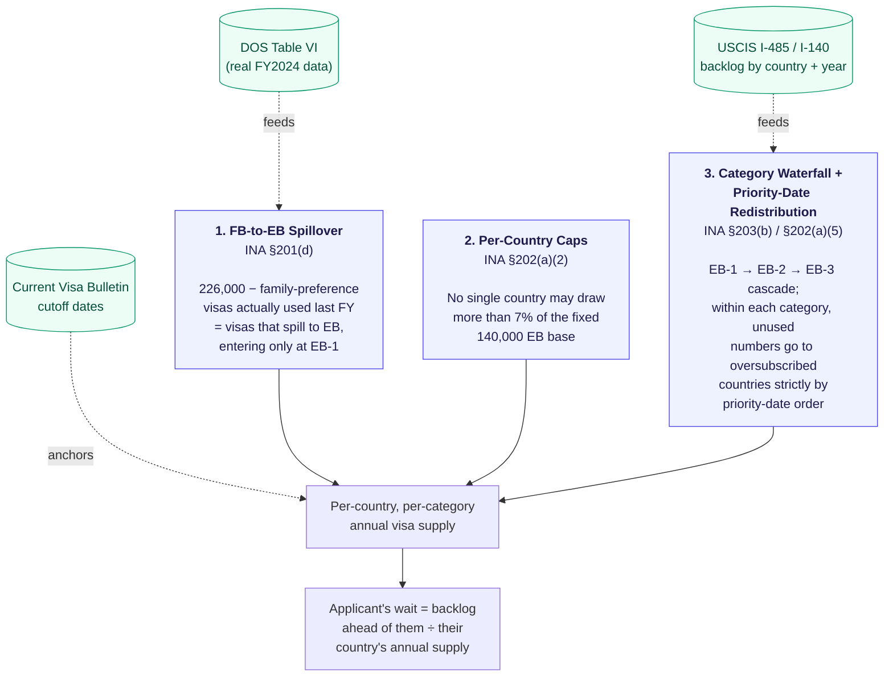
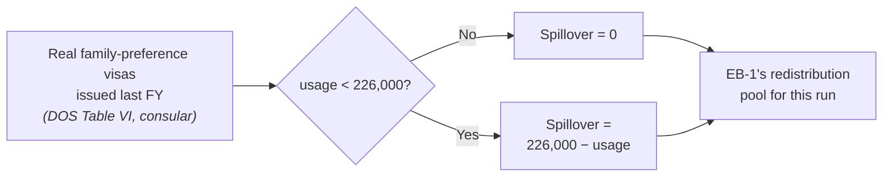
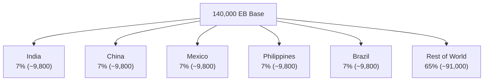
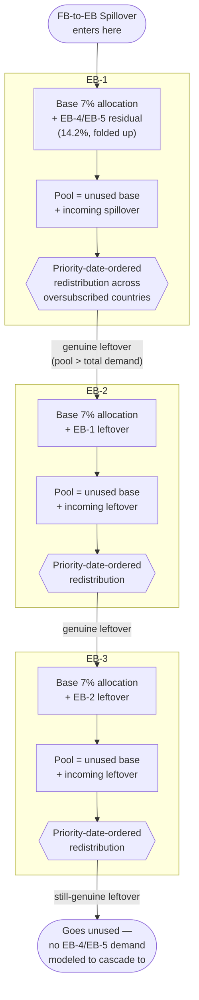
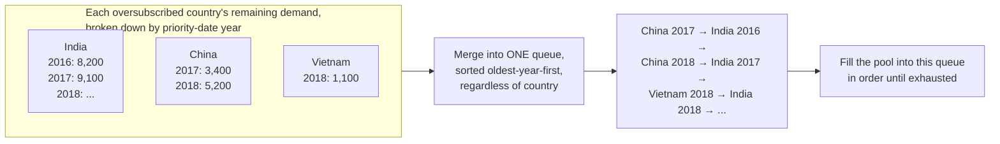
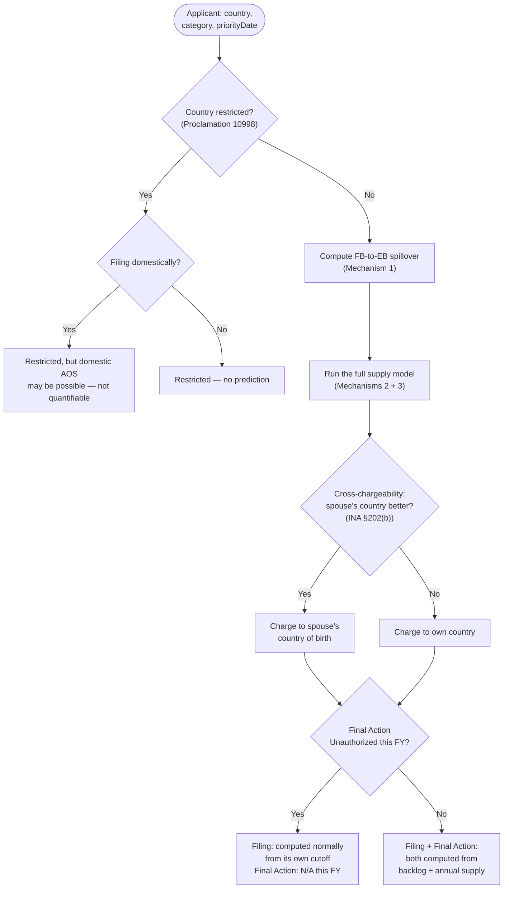

# GreenCardPredictor

A Spring Boot service that predicts U.S. employment-based (EB) green card **Filing** and **Final
Action** dates for a given country, EB category, and priority date — by actually simulating the
statutory visa-allocation mechanics (INA §201, §202, §203) against real USCIS/DOS data, rather than
guessing from historical trend lines.

> Built on real data where it's obtainable, honestly labeled placeholders where it isn't. See
> [`GAPS_AND_FIXES.md`](GAPS_AND_FIXES.md) for the full changelog and every known limitation, and
> [`DATA_SOURCES.md`](DATA_SOURCES.md) for exactly which government reports back which number.

## What it actually predicts

Given `{country, category, priorityDate}`, it returns:

- **Filing date** — when you can submit Form I-485 / DS-260 (Visa Bulletin Chart B)
- **Final Action date** — when your green card can actually be approved (Visa Bulletin Chart A)
- **A full `reasoningSteps` trace** — every intermediate number the calculation used, in order,
  so the result isn't a black box

It does **not** predict what a *future* Visa Bulletin will say. It takes one bulletin's real,
published cutoff dates as an input and computes how long an applicant's *own* wait is against that
bulletin — a materially different (and much more tractable) problem than forecasting DOS's monthly
cutoff-date decisions.

## Quick start

Requires JDK 17+ (the project's own `pom.xml` pins `java.version=21` for the compiler `--release`
flag).

```bash
./mvnw spring-boot:run
```

```bash
curl -u admin:admin123 -X POST http://localhost:8080/api/prediction/predict \
  -H "Content-Type: application/json" \
  -d '{"country":"INDIA","category":"EB3","priorityDate":"2019-12-16"}'
```

`admin`/`admin123` are the default dev credentials in `application.properties` — change them before
deploying this anywhere real.

## How it works

### The three statutory mechanisms

Everything the algorithm does traces back to three sections of the INA, applied in this order:



### Mechanism 1 — FB-to-EB Spillover (INA §201(d))

Congress sets a **226,000/year floor** for family-sponsored visas. Whatever of that floor goes
unused in a fiscal year rolls over to the employment-based pool the *next* year — entering
specifically at **EB-1**, not spread across all three categories.



### Mechanism 2 — Per-Country Caps (INA §202(a)(2))

Only five countries currently have their own named line on the Visa Bulletin's per-country chart —
**India, China, Mexico, Philippines, Brazil** — each capped at 7% of the fixed 140,000 base
(~9,800). Every other country falls under *"All Chargeability Areas Except Those Listed"* (ROW),
sharing the remaining 65%.



Every other country enum in the codebase (restricted or not) gets **zero** individual base
allocation — it can only receive supply through redistribution, exactly like the real bulletin's
"All Chargeability Areas" treatment. Giving every country its own 7% share was a real bug found and
fixed this year (see GAPS_AND_FIXES.md #9).

### Mechanism 3 — The Waterfall + Priority-Date Redistribution (INA §203(b) / §202(a)(5))

This is the core of the engine. For each category, in **EB-1 → EB-2 → EB-3** order:



**Why horizontal (cross-country) redistribution runs *before* the vertical cascade to the next
category** — this is the opposite of the codebase's original order, and matters a lot: if the
vertical cascade ran first (draining every country's surplus down the chain before any other
country got a look at it), EB-1 and EB-2 could *never* receive cross-country redistribution — 100%
of the world's unused capacity would always land in EB-3 by construction. Verified and fixed this
year; see GAPS_AND_FIXES.md #13.

**Priority-date-ordered redistribution**, in detail:



Every country's own yearly buckets sum to exactly its own remaining demand, so this construction
guarantees **no country can ever receive more redistributed visas than it actually needs** — a
correctness property that used to require an iterative "water-filling" algorithm to enforce and now
falls out for free. See GAPS_AND_FIXES.md #14.

### End-to-end request flow



**Filing and Final Action are independent charts.** DOS can mark Final Action "Unauthorized" (the
annual ceiling is hit) while still publishing a real Filing cutoff, specifically so people can keep
submitting paperwork and get interim benefits (EAD/AP) while waiting for new numbers. A past version
of this code collapsed both into "N/A" the moment Final Action hit its ceiling — fixed; see
GAPS_AND_FIXES.md #12.

## Reading a response

Every prediction includes a `reasoningSteps` array — the calculation's own trace, in order:

```json
{
  "formattedFilingWait": "September 2030",
  "formattedFinalActionWait": "April 2032",
  "reasoningSteps": [
    "1. Checked restriction status for INDIA: not restricted.",
    "2. FB-to-EB spillover (INA 201(c)/(d)): family-preference visa usage (DOS Table VI real figure) = 205762. Statutory floor = 226000. Spillover = max(0, floor - usage) = max(0, 226000 - 205762) = 20238.",
    "3. Base EB pool = 140000 (fixed statutory floor, INA 201(d)). Individual per-country cap (7% of the fixed base, applies only to [INDIA, CHINA, PHILIPPINES, MEXICO, BRAZIL]) = 9800. ...",
    "4. Ran the full supply model: base allocation (from the fixed base only), FB spillover injected at EB-1, EB1->EB2->EB3 waterfall with horizontal (cross-country, priority-date-ordered) redistribution ...",
    "5. INDIA EB3 resulting annual supply (after redistribution): ~10692.",
    "6. September 2026 bulletin Filing Cut-off for INDIA EB3: 2015-01-15.",
    "7. Backlog (I-485 inventory + I-140 approvals) between the Filing Cut-off and priority date 2019-12-16: 43268 cases ahead of you.",
    "8. September 2026 bulletin Final Action Cut-off for INDIA EB3: 2014-01-01.",
    "9. Filing wait = 43268 / 10692 * 12 = 48 months; Final Action wait = ...",
    "Conclusion: Filing September 2030, Final Action April 2032."
  ]
}
```

## API

| Endpoint | Method | Body | Notes |
|---|---|---|---|
| `/api/prediction/test` | GET | — | Hardcoded India/EB2 smoke test |
| `/api/prediction/predict` | POST | `Applicant` JSON | The real endpoint |

**`Applicant` request fields:**

| Field | Required | Notes |
|---|---|---|
| `country`, `category`, `priorityDate` | Yes | `priorityDate` as `YYYY-MM-DD` |
| `manualFbSpillover` | No | Override the computed spillover for testing/simulation |
| `familyVisaPauseSeverity` | No | `0.0`–`1.0`; models a consular-interview disruption's effect on family visa usage |
| `consularShutdown` | No | Simulates 2020–2022-style EB-2 prioritization during consular disruption |
| `spouseCountryOfBirth` | No | Enables INA §202(b) cross-chargeability |
| `filingDomestically` | No | For restricted countries: whether domestic AOS may still apply |

All authenticated with HTTP Basic (stateless — no CSRF, no session cookie; see `SecurityConfig`).

## Data sources

| Data | Source | Vintage |
|---|---|---|
| EB backlog (I-485 pending) | USCIS EB I-485 Inventory report | April 2026 |
| EB backlog (I-140 approved) | USCIS I-140 receipts/approvals by class & country | FY2026 Q3 |
| Visa Bulletin cutoffs | `travel.state.gov` Visa Bulletin | September 2026 |
| Restricted-country list | Presidential Proclamation 10998 | As of 2026-09-25 |
| Family-preference visa usage | **DOS Table VI**, Report of the Visa Office (real, consular-issued) | FY2024 |

Full provenance, exact filenames, and every documented gap: [`DATA_SOURCES.md`](DATA_SOURCES.md).

## Known limitations (short version)

- Family-preference usage is real DOS data, but **FY2024** — not FY2026, the year the current
  travel-ban and consular-closure disruptions actually happened in. FY2026's real numbers won't be
  published for months.
- EB backlog data is ~5 months stale (the newest USCIS has published as of this writing).
- This app **cannot forecast future Visa Bulletin cutoff dates** — DOS's month-to-month decisions
  involve deliberate caution margins and internal projections this model doesn't attempt to
  replicate.
- No individual case-level nuance (RFEs, consular post capacity, processing delays).

Full history of every bug found and fixed this year, with root causes and verification: see
[`GAPS_AND_FIXES.md`](GAPS_AND_FIXES.md).

## Project structure

```
src/main/java/org/innovativebrains/greencardpredictor/
├── config/              Spring config: security, visa-bulletin @ConfigurationProperties
├── controller/          REST endpoints
├── model/               Applicant, Country, EbCategory, PredictionResult
└── service/
    ├── ExcelDataService.java     Parses USCIS backlog workbooks + DOS Table VI data
    ├── VisaBulletinService.java  Current bulletin cutoff dates
    └── PredictionService.java    The algorithm described above
```
